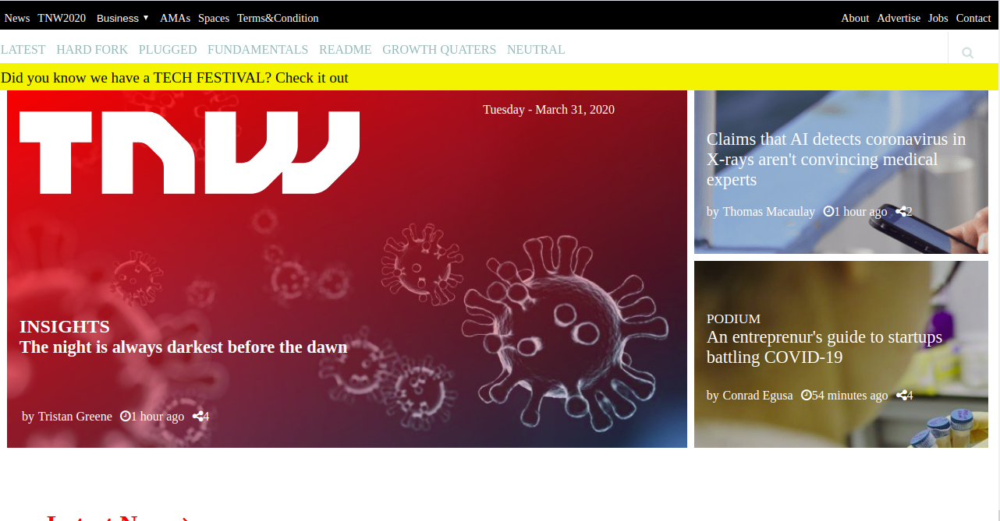

# thenextweb.com clone
This project is a clone of thenextweb.com [thenextweb.com](https://thenextweb.com/) website

## Preview

### Additional description about the project and its features
 The purpose of this project is to practice building a responsive web page making the website to appear differently on different devices depending on the device width. The features of this web page are summarized below:
# Background images
  Background imagea were added using the background image link of the original web page or pictures for the sake of the project. The original web page background changes automatically though. I applied linear gradient to ensure that the text written on the background images are readable. I used position values and no-repeat to make the image single and centered. The sections of the web page containing different images are laid out using CSS flex box and grid layout.
# Various Sections
  This project is categorized into five different sections. The section after the navigation area contains one major box and two boxes by the side. This boxes has background images and contains link to various articles as highlighted. The second section contains eight boxes with background images linking to different articles as shown by the description link below them. The third section contains four boxes with pictures, icons and link to different articles as shown by each unit. The fourth section contains eight units with background images linking to different articles as described by the title above each unit. Like the second section, the fifth section contains eight boxes with background images linking to different articles as shown by the description below each unit. Each section was arranged using CSS grid and CSS flex box where needed. This description is the default appearance at min-width of 1024px.

# Footer
  The footer contains icons for the social media links. The icons as well as the copyrigtht text are centerd.

## Built With
- HTML
- CSS
- CSS Flex box
- CSS Grid

## Live Demo
[Live Demo Link](https://rawcdn.githack.com/Zubenna/nextweb-clone/391d7957c3b47d85f08611142194375394622c6e/index.html) hosted on [githack](https://raw.githack.com)

## CDNs
- https://fontawesome.com/icons

## Steps For Installation
- After cloning this repo, git clone [repo](https://github.com/Zubenna/nextweb-clone/tree/feature-branch), cd into nextweb-clone folder.
- Open the index.html file in your favourite browser, and that's it!!!

## Author
- Github: [@githubhandle](https://github.com/zubenna)
- Twitter: [@twitterhandle](https://twitter.com/zubenna)
- Linkedin: [@linkedin](https://linkedin.com/in/nnamdi-emelu-08b14340/)

## 🤝 Contributing
Contributions, issues and feature requests are welcome!
Feel free to check the [issues page](issues/).

## Show your support
Give a ⭐️ if you like this project!

## Acknowledgments
- Hat tip to anyone whose code was used
- Inspiration, etc

